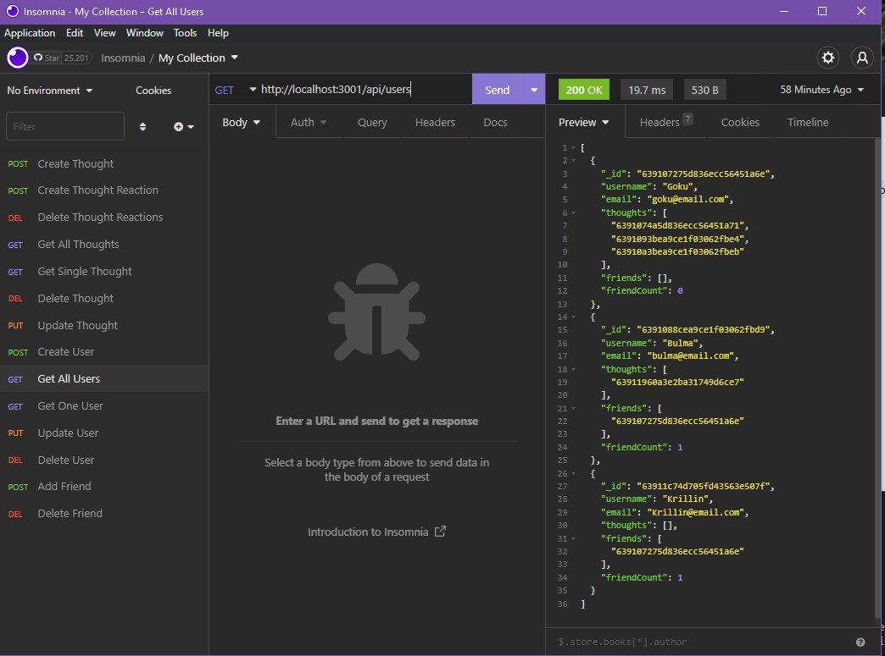
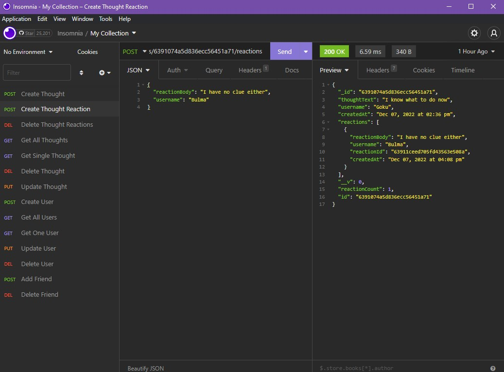

# Social Network API 👩‍💻👨‍💻💭

## Description

Hello and welcome to the world of cutting-edge social networks. This application is created using Mongoose and MongoDB to create the backend of a theoretical social network in which users can create and react to thoughts. Users and Thoughts can all be created, read, updated and deleted while the reactions can be read, created and deleted. The Reactions are linked to the thoughts and deletion of thoughts will delete reactions. Deletion of user will delete thoughts as well. Let's get into it!

### Table of contents
- [Description](#description)
- [Installation Instructions](#installation-instructions)
- [Usage Guidelines](#usage-guidelines)
- [Contact](#contact)

## Installation Instructions

To get started, download this repo via your preferred method of choice. Once downloaded run `npm install` to install all of the requirements. You will also need to have MongoDB installed and set up. To utilize this application, use an API client like Insomnia to hit the various endpoints.

## Usage Guidelines

The following are the list of valid endpoints
 

**Post/Get For Creation and Viewing of all Users**
* `http://localhost:3001/api/users`
 

**GET/PUT/DELETE Individual Users**
* `http://localhost:3001/api/users/[UserID]`
 

**POST/DELETE Friends of User**
* `http://localhost:3001/api/users/[UserID]/friends/[friendID]`
 

**POST/GET for Creation of Thoughts And View ALl**
* `http://localhost:3001/api/thoughts/`
 

**GET/PUT/DELETE Individual Users**
* `http://localhost:3001/api/thoughts/[thoughtId]`
 

**POST CREATION OF REACTION**
* `http://localhost:3001/api/thoughts/[thoughtId]/reactions`
 

**DELETE REACTION**
* `http://localhost:3001/api/thoughts/[thoughtId]/reactions/[IdOfReactionToBeDeleted]`
 

By utilizing these endpoints you are able to interact with the database in accordance with the expected models.

Please See The Following Youtube Videos for a demonstration on how these work

[Video Demonstrating Main Functionality](https://www.youtube.com/watch?v=Z5JtcSxTlGM)

[Video Demonstrating Deletion of User Also Deletes Thoughts](https://www.youtube.com/watch?v=-q1m8cWqTk8)

### Screenshots

## Questions? Contact me

[Find me on GitHub](https://github.com/hburnton)

[Send me an email](mailto:hburnton@gmail.com)

[Project Page on Github](https://github.com/HBurnton/Social-Network-API)